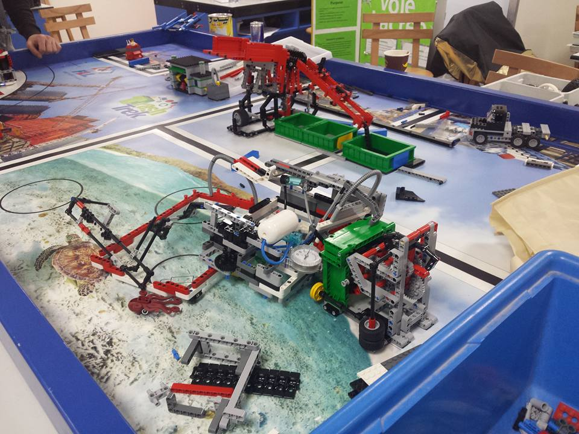

Convex Human is a blog that discusses mathematical insights, and highlights great ideas, all in the field of Optimization, Approximation Theory and Numerical Analysis. At the time I am writing this, the blog is just in its first days, so there are not so many topics. But you are supposed to find blog posts on other topics that I find interesting and feel like I want to share them with the world.

## Who is Convex Human?
My name is Mohammed Amarnah, I am a Computer Science student, graduating from PSUT, Jordan. My interest in Computer Science started when I was 14, where I developed my first Windows Phone mobile app, which was an event app for TEDxAlFaisalU. Even though the app was very basic and with almost no functionality other than moving between windows, I fell in love with programming.

After that and in my final school years and while moving from school to university, I participated in several science fairs and competitions. One of the most interesting experiences, were the First Lego League Robotics Championship. It started in my 11th grade. We won the programming award, locally and regionally, 3 consecutive times, and 5 times overall. In my first undergraduate year, I became a coach for my high school's FLL team. We won the 2nd place Champion's award locally in Jordan, regioanlly in Lebanon, and internationally in Tenerife, Spain.

In all the past years, I liked competitions and robotics and so on, but I didn't feel the same for academia and research. Maybe because I thought it was really hard (it is hard, actually!) or maybe because I never tried to get into the theortical part of stuff.

In the 2nd year in my college, I enrolled in an Electronics course, and everything in there changed me a lot. Electricity and Electronics makes you look at Computer Science in a completely different way, yet it stays extremely similar to the mindset of a computer scientist.

As my graduation project from that course, I built an Electroencephalogram recorder, with basic components and without any microcontrollers. I also built a small PID line following robot, without the use of any programmable components.

## My Interest In Mathematics and Machine Learning

Since then, I knew that theoretical science is something I would like to dig deep in. I started reading about Machine Learning, but this time I was reading from a completely different perspective. This time, I was reading research papers and text books. I enrolled in Coursera’s Stanford Machine Learning course by the great Andrew Ng, and after finishing it, I decided to enroll in Udacity’s Self Driving Car Engineer nano-degree.
While approaching my final university years, I had to decide what to do as my graduation project. I started with a very interesting where I researched the possibilities of detecting brain tumors using EEG data only and without any MRI or CT scans. But because there wasn’t any mentor at my university who accepted to mentor me on this project, I decided to build the first open source self driving car. And it happened! CBM64, is now the first arabic open source self driving car (available on my GitHub, and your contributions are very welcome!)

## Curriculum Vitae
You can find my latest cv [here]().